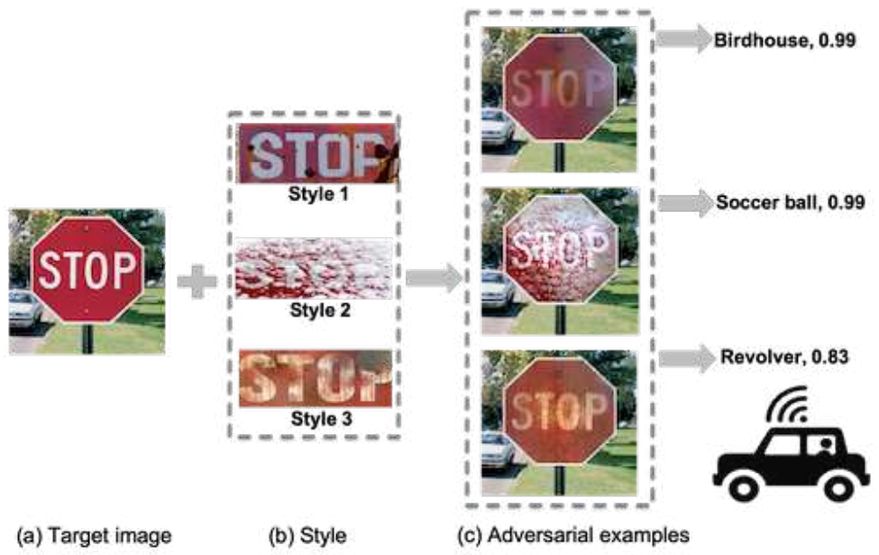
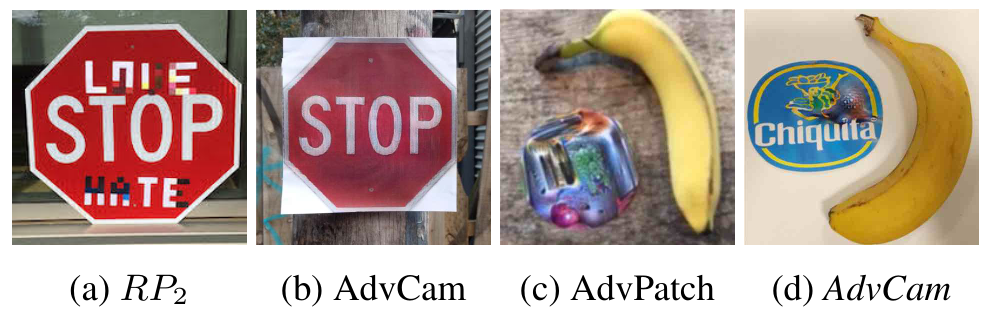
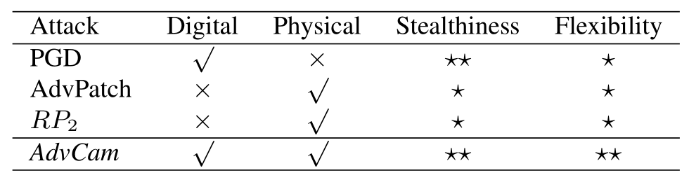
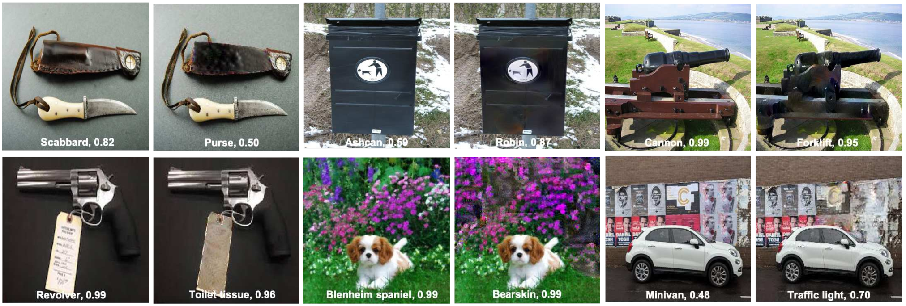

# Adversarial Camouflage

> Adversarial Camouflage: Hiding Physical-World Attacks with Natural Styles.

- [Main contributions](#main-contributions)
- [Background](#background)
  - [Adversarial attack settings](#adversarial-attack-settings)
  - [Adversarial attack properties](#adversarial-attack-properties)
  - [Existing attacks](#existing-attacks)
- [Algorithm for AdvCam](#algorithm-for-advcam)
- [Results](#results)
- [Referred in](#referred-in)

:::tip 🌏 Source
🔬 Downloadable at: https://arxiv.org/abs/2003.08757. CVPR 2020.
:::

Adversarial Camouflage, AdvCam, transfers large adversarial perturbations into customized styles, which are then “hidden” on-target object or off-target background. Focuses on physical-world scenarios, are well camouflaged and highly stealthy, while remaining effective in fooling state-of-the-art DNN image classifiers.

## Main contributions

- Propose a flexible adversarial camouflage approach, **AdvCam**, to craft and camouflage adversarial examples.
- **AdvCam** allows the generation of **large perturbations, customizable attack regions and camouflage styles.**
- It is very flexible and useful for vulnerability evaluation of DNNs against large perturbations for physical-world attacks.

## Background

### Adversarial attack settings

- Digital settings.
- Physical-world settings.

### Adversarial attack properties

- Adversarial strength: represents the ability to fool DNNs.
- Adversarial stealthiness: describes whether the adversarial perturbations can be detected by human observers.
- Camouflage flexibility: the degree to which the attacker can control the appearance of adversarial image.

### Existing attacks

## Algorithm for AdvCam

Normal attacks try to find an adversarial example for a given image by solving the following optimization problem:

$$\textrm{minimize}\ \mathcal{D}(x,x')+\lambda\cdot\mathcal{L}_{adv}(x')\ \textrm{such that}\ x'\in[0,255]^m$$

Where the $\mathcal{D}(x,x')$ defines the "stealthiness" property of the adversarial example, and the $\mathcal{L}_{adv}$​ is the adversarial loss. Which means that **there is a trade off between stealthiness and adversarial strength.**

We use style transfer techniques to achieve the goal of camouflage and adversarial attack techniques to achieve adversarial strength. In order to do so, our loss function, which we call the **adversarial camouflage loss**, becomes:

$$\mathcal{L}=(\mathcal{L}_{s}+\mathcal{L}_{c}+\mathcal{L}_{m})+\lambda\cdot\mathcal{L}_{adv}$$

The final overview of our AdvCam approach:

## Results

Camouflaged adversarial images crafted by our AdvCam attack and their original versions.

:::backlinks
## Referred in
* [[papers]]
	* | Paper Title                         | Publication |
| [[invisible-adv]]                   | IEEE 2019   |
| [[robust-adversarial-perturbation]] | CVPR 2020   |
| [[perceptual-color-distance]]       | CVPR 2020   |
| [[adversarial-camouflage]]          | CVPR 2020   |
:::

[//begin]: # 'Autogenerated link references for markdown compatibility'
[papers]: papers.md 'Papers'
[invisible-adv]: invisible-adv.md 'Invisible Adversarial Attack'
[robust-adversarial-perturbation]: robust-adversarial-perturbation.md 'Robust Adversarial Perturbation'
[perceptual-color-distance]: perceptual-color-distance.md 'Perceptual Color Distance'
[adversarial-camouflage]: adversarial-camouflage.md 'Adversarial Camouflage'
[//end]: # 'Autogenerated link references'
