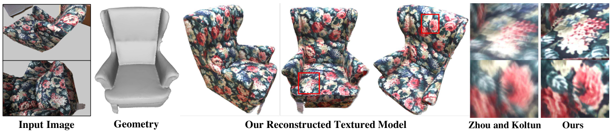
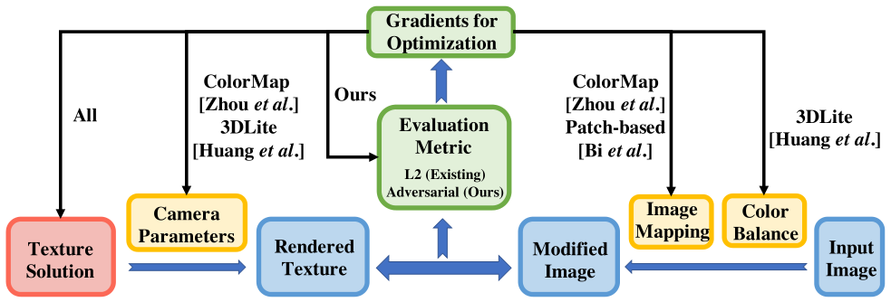
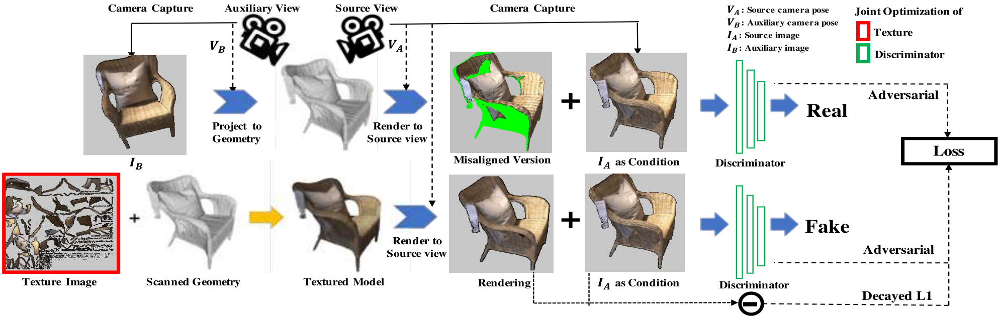

# Adversarial Texture Optimization

> Adversarial Texture Optimization from RGB-D Scans.

- [Main contributions](#main-contributions)
- [Methods](#methods)
  - [Misalignment-Tolerant Metric](#misalignment-tolerant-metric)
  - [Texture Optimization](#texture-optimization)
  - [Differentiable Rendering and Projection](#differentiable-rendering-and-projection)
- [Evaluation metrics](#evaluation-metrics)
- [Results](#results)
  - [Synthetic 3D Examples](#synthetic-3d-examples)
  - [Increasing the camera/geometry error gradually](#increasing-the-camerageometry-error-gradually)
- [Referred in](#referred-in)

:::tip 🌏 Source
🔬 Downloadable at: [https://arxiv.org/abs/1911.02466](https://arxiv.org/abs/1911.02466). CVPR 2020.
:::

Introduces a new method to construct **realistic color textures in RGB-D surface reconstruction problems.** Specifically, this paper proposes an approach to produce photorealistic textures for approximate surfaces, even from misaligned images, by learning an objective function that is robust to these errors.

## Main contributions

**Key idea:** to account for misalignments in a learned objective function of the texture optimization.

**Benefits:**

- Rather that using a traditional object function, like L1 or L2, here we learn a new objective function **(adversarial loss)** that is robust to the types of misalignment present in the input data.
- This novel approach eliminates the need for **hand-crafted parametric models for fixing the camera parameters, image mapping, or color balance and replaces them all with a learned evaluation metric.**

The key idea of this approach is to learn a patch-based conditional discriminator which guides the texture optimization to be tolerant to misalignments. Our discriminator takes a synthesized view and a real image, and evaluates whether the synthesized one is realistic, under a broadened definition of realism.

## Methods

From an input RGB-D scan, we optimize for both its texture image and a learned texture objective function characterized by a discriminator network.

### Misalignment-Tolerant Metric

For each optimization iteration, we randomly select two input images, $I_A$ (source image) and $I_B$ (auxiliary image) with corresponding camera poses $V_A$ and $V_B$. The conditioning is $I_A$ from the viewpoint $V_A$, and the 'real' image is $I_B$ projected to the scan geometry and rendered from $V_A$, while the 'fake' image is the synthesized texture rendered from $V_A$.

### Texture Optimization

To retrieve a texture, we jointly optimize the texture and the misalignment-tolerant metric. Our view-conditioned adversarial loss function:

$$\mathscr{L}_c(T,D)=\mathbb{E}_{x,y}(\log D(x,y))+\mathbb{E}_{x,M_x}(\log(1- D(x,M_x(T))))$$

- $T$: target texture image.
- $D$: discriminator parameters.

The adversarial loss above is difficult to train alone, we add an L1 loss to the texture optimization to provide initial guidance:

$$\mathscr{L}_{L1}(T)=\mathbb{E}_{x,y,M_x}\|y-M_x(T)\|_1$$

And the final objective texture solution:

$$T^*=\textrm{arg}\ \underset{T}{\min}\ \underset{D}{\max}\ \mathscr{L}_C(T,D)+\lambda\mathscr{L}_{L1}(T)$$

### Differentiable Rendering and Projection

To enable the optimization of the RGB texture of a 3D model, we leverage a differentiable rendering to generate synthesized 'fake' views.

1. Pre-compute a view-to-texture mapping using `pyRender`.
2. Implement the rendering with a differentiable bilinear sampling.

## Evaluation metrics

| Metric                                                 | Notes                                                                                                                                                                                                   |
| :----------------------------------------------------- | :------------------------------------------------------------------------------------------------------------------------------------------------------------------------------------------------------ |
| Nearest patch loss                                     | For each pixel $\textbf{u}$ we extract a 7×7 patch around it in the generated texture and find the L2 distance $d(\textbf{u})$ between it and the nearest neighbor patch in the ground truth texture.   |
| Perceptual metric                                      | To evaluate perceptual quality.                                                                                                                                                                         |
| Difference between generated textures and ground truth | Measure this according to sharpness and the average intensity of image gradients, in order to evaluate how robust the generated textures are to blurring artifacts without introducing noise artifacts. |

We cannot use standard image quality metrics such as MSE, PSNR or SSIM - [[image-quality-assessment]], **as they assume perfect alignment between target and the ground truth.**

## Results

### Synthetic 3D Examples

Texture generation in case of high camera or geometry errors.

### Increasing the camera/geometry error gradually

Texture generation under increasing camera or geometry errors.

:::backlinks
## Referred in
* [[papers]]
	* | Paper Title                          | Publication |
| [[adversarial-texture-optimization]] | CVPR 2020   |
:::

[//begin]: # "Autogenerated link references for markdown compatibility"
[image-quality-assessment]: image-quality-assessment.md "Image Quality Assessment"
[papers]: papers.md "Papers"
[adversarial-texture-optimization]: adversarial-texture-optimization.md "Adversarial Texture Optimization"
[//end]: # "Autogenerated link references"
