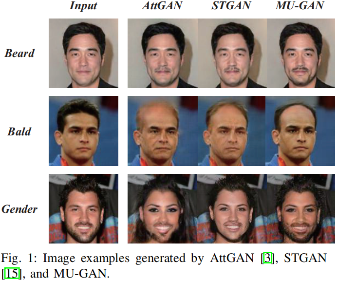
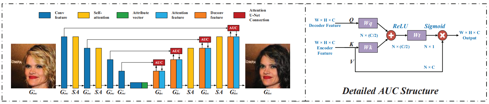

# MU-GAN

> MU-GAN: Facial Attribute Editing based on Multi-attention Mechanism.

- [Brief introduction](#brief-introduction)
- [Main contributions](#main-contributions)
- [Method overview](#method-overview)
	- [Generator](#generator)
		- [Attention U-Net Connection: AUCs](#attention-u-net-connection-aucs)
		- [Self-attention](#self-attention)
	- [Discriminator](#discriminator)
	- [Loss functions](#loss-functions)
- [Experiments](#experiments)
- [Conclusion](#conclusion)
- [Referred in](#referred-in)

:::tip 🌏 Source
Available at: <https://arxiv.org/abs/2009.04177>. Source code at: [SuSir1996/MU-GAN](https://github.com/SuSir1996/MU-GAN).
:::

## Brief introduction

Task: **facial attribute editing**, which has two main objectives:

1. To translate an image from a source domain to a target one
2. only change the facial regions related to a target attribute and preserving the attribute-excluding details

The **Multi-attention U-Net-based Generative Adversarial Network (MU-GAN)**:

- "Classic convolutional encoder-decoder" --> "Symmetric U-Net-like structure in a generator": Apply an additive attention mechanism to build attention-based U-Net connections for adaptively transferring encoder representations to complement a decoder with attribute-excluding detail and enhance attribute editing ability.
- A self-attention mechanism is incorporated into convolutional layers for modeling long-range and multi-level dependencies across image regions.

## Main contributions

CNN-based GANs are good at editing local attributes and synthesizing images with few geometric constraints. However, they have difficulty in editing images with geometric or structural patterns (such as facial attribute editing). It is also known that there are complex coupling relationships among facial attributes (e.g.: gender and beard).

Thus, a desired model needs to have the ability to decouple attributes in order to meet the requirements of the target labels. To solve these problems, we construct a new generator with a novel encoder-decoder architecture and propose a **Multi-attention U-Net-based GAN (MU-GAN) model.**

- We construct a symmetric U-Net-like architecture generator based on additive attention mechanism, which effectively enhances our method's detail preservation and attribute manipulation abilities.
- We take a self-attention mechanism into the existing encoder-decoder architecture thus effectively enforcing geometric constraints on generated results.
- We introduces a multi-attention mechanism to help attribute decoupling, i.e., it only changes the attributes that need to be changed.

## Method overview

### Generator

#### Attention U-Net Connection: AUCs

For detailed retention and blurry image problems, the paper replaces the original asymmetric CNN-based encoder-decoder with a symmetrical Attention U-Net architecture. Besides, instead of directly connecting an encoder to a decode via skip-connections, **the paper present AUCs to selectively transfer attribute-irrelevant representations from an encoder.** Then, AUCs concatenate encoder representation with decoder ones to improve image quality and detail preservation.

**With an attention mechanism**, AUCs are capable of **filtering out representations related to original attributes** while **preserving attribute-irrelevant details**. It can **promote the image fidelity** without **weakening attribute manipulation ability**.

Self-attention mechanism.

#### Self-attention

### Discriminator

real / fake: two sub-networks.

### Loss functions

MU-GAN

- Generator = $G_{enc}$ + $G_{dec}$
- Loss:
    - Adversarial loss
    - Attribute classification
    - Reconstruction loss

## Experiments

Compare `MU-GAN` with `AttGAN` and `STGAN`.

## Conclusion

Multi-attention mechanism: AUCs and self-attention mechanisms → into a symmetrical U-Net-like architecture.

:::backlinks
## Referred in
* [[papers]]
	* | Paper Title                          | Publication |
| [[mu-gan]]                           | CVPR 2020   |
| [[adversarial-texture-optimization]] | CVPR 2020   |
:::

[//begin]: # "Autogenerated link references for markdown compatibility"
[papers]: papers.md "Papers"
[mu-gan]: mu-gan.md "MU-GAN"
[adversarial-texture-optimization]: adversarial-texture-optimization.md "Adversarial Texture Optimization"
[//end]: # "Autogenerated link references"
