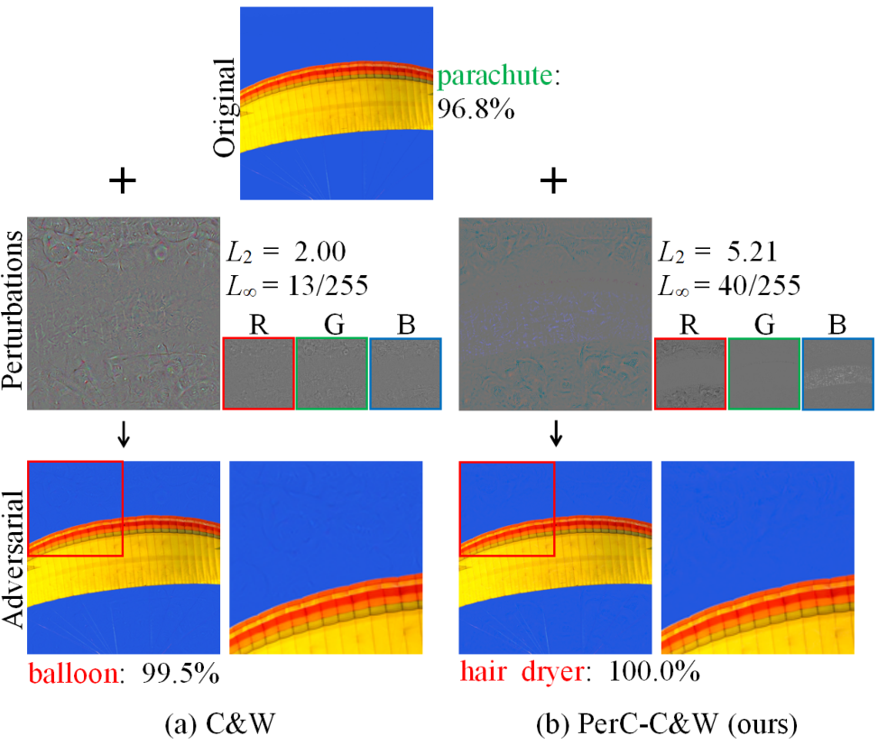
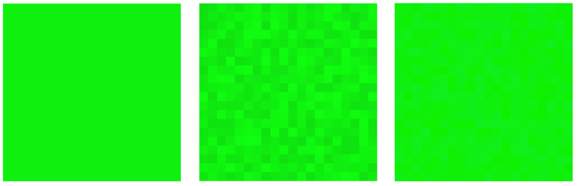
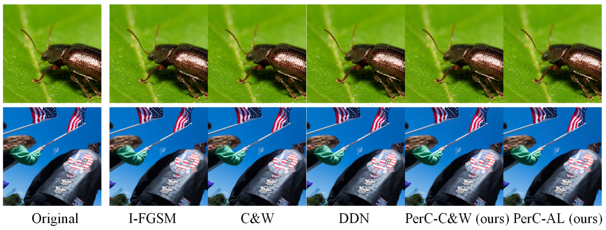
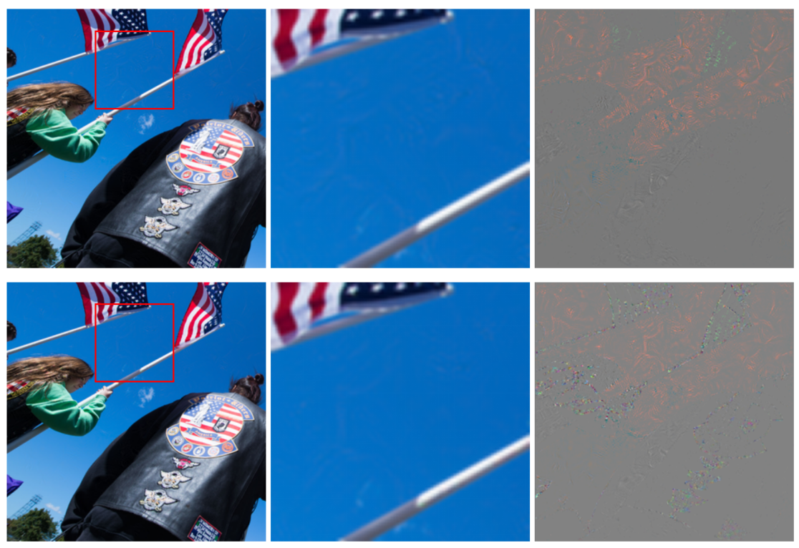

# Perceptual Color Distance

> Towards Large yet Imperceptible Adversarial Image Perturbations with Perceptual Color Distance.

- [Main contributions](#main-contributions)
- [Inspirations](#inspirations)
- [Proposed approaches](#proposed-approaches)
  - [Algorithm #1: Perceptual color distance penalty (PerC-C&W)](#algorithm-1-perceptual-color-distance-penalty-perc-cw)
  - [Algorithm #2: Perceptual color distance alternating loss (PerC-AL)](#algorithm-2-perceptual-color-distance-alternating-loss-perc-al)
- [Experiments](#experiments)
  - [Adversarial strength and imperceptibility](#adversarial-strength-and-imperceptibility)
  - [Robustness](#robustness)
  - [Transferability](#transferability)
  - [Assembling structural information](#assembling-structural-information)
- [Conclusions](#conclusions)
- [Referred in](#referred-in)

:::tip 🌏 Source
🔬 Downloadable at: https://arxiv.org/abs/1911.02466. CVPR 2020.
:::

Introduces a novel method to incorporate perceptual color distances into adversarial attacks. Adversarial examples constructed with this method have large $\ell_p$ perturbations while still remain inperceptible to the human eye.

## Main contributions

Two novel adversarial attacks:

- Perceptual color distance C&W (PerC-C&W): replaces the $\ell_2$ loss used in C&W attacks directly with PerC distance.
- Perceptual color distance alternating loss (PerC-AL): optimizes alternating loss (AL) functions, switching between classification loss and perceptual color distance.

## Inspirations

Here, we take a solid color image (left) and add the same perturbations to the green channel (middle) and to the blue channel (right). Image demo below:

- Left: original image
- Middle: Image perturbed by adding noise in the G channel
- Right: Image perturbed by adding the identical noise but in the B channel

Although both RGB channels were perturbed identically, the perturbations are only visible in the green channel. **The reason is that color as it is perceived by the human eye does not change uniformly over distance in RGB space.** Relatively large changes in RGB space may remain unnoticeable if they lead to small perceived color difference.

## Proposed approaches

### Algorithm #1: Perceptual color distance penalty (PerC-C&W)

PerC-C&W adopts the joint optimization of the well-known C&W, but replaces the original penalty on the L2 norm with a new one based on perceptual color difference.

$$\underset{w}{\textrm{minimize}} \| \Delta E_{00}(x, x') \|_2+\lambda f(x')$$

### Algorithm #2: Perceptual color distance alternating loss (PerC-AL)

PerC-C&W requires **time consuming binary search** in order to find an optimal $\lambda$. To address the inefficiency, we propose PerC-AL, which decouples the joint optimization by alternately updating the perturbations with respect to either classification loss or perceptual color difference.

## Experiments

### Adversarial strength and imperceptibility

Examples of adversarial images generated by five different approaches with high confidence.

### Robustness

I-FGSM achieves higher robustness but ends up with worse image qualities. PerC-C&W and PerC-AL consistently achieve better overall results.

### Transferability

I-FGSM, while outperforms others, uses excessive perturbations. Our PerC approaches are best among others.

### Assembling structural information

With the help of additional structural information, perturbations in the smooth regions are suppressed, while more changes, which are barely perceptible, are triggered in the area with rich visual variation.

## Conclusions

Perceptual color distance is able to improve imperceptibility, **especially in smooth, saturated regions.** Nice work. I believe **perturbing specific color channels** and/or **different color channels in different image semantic areas** may be a valid adversarial attack approach.

:::backlinks
## Referred in
* [[papers]]
	* | Paper Title                         | Publication |
| [[invisible-adv]]                   | IEEE 2019   |
| [[robust-adversarial-perturbation]] | CVPR 2020   |
| [[perceptual-color-distance]]       | CVPR 2020   |
| [[adversarial-camouflage]]          | CVPR 2020   |
:::

[//begin]: # 'Autogenerated link references for markdown compatibility'
[papers]: papers.md 'Papers'
[invisible-adv]: invisible-adv.md 'Invisible Adversarial Attack'
[robust-adversarial-perturbation]: robust-adversarial-perturbation.md 'Robust Adversarial Perturbation'
[perceptual-color-distance]: perceptual-color-distance.md 'Perceptual Color Distance'
[adversarial-camouflage]: adversarial-camouflage.md 'Adversarial Camouflage'
[//end]: # 'Autogenerated link references'
