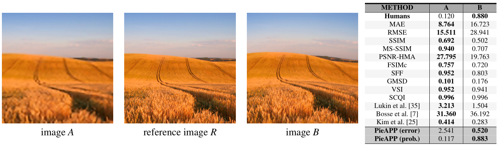

# PieAPP

> PieAPP: Perceptual Image-Error Assessment through Pairwise Preference.

- [Brief introduction](#brief-introduction)
- [Main contributions](#main-contributions)
- [Method overview](#method-overview)
- [Experiments](#experiments)
- [Referred in](#referred-in)

:::tip 🌏 Source
Available at <https://arxiv.org/abs/1806.02067>, source code available at: [prashnani/PerceptualImageError](https://github.com/prashnani/PerceptualImageError).
:::

## Brief introduction

- The paper proposes a new, large-scale dataset labeled with the **probability** that humans will prefer one image over another.
- Then the paper trains a deep-learning model using a novel, **pairwise-learning framework** to predict the preference of one distorted image over the other.

The new metric: PieAPP, correlates well with human opinion, and performs almost 3 times better than existing metrics.

## Main contributions



- **Dataset**: The paper doesn't explicitly convert the human preference into a quality score. Instead, they simply label the pairs by the percentage of people who preferred image $A$ over $B$.
- **Pairwise-learning framework**: The framework trains an error-estimation function using the probability labels in the dataset.

  ```
  ---------------------
  | Distorted Image A | \
  ---------------------  \
                          \
  ---------------------    \  | Error estimation function #1 |       | Perceptual Error Score: A |
  | Reference Image R | -->-- |--------- IDENTICAL ----------| -->-- |---------------------------|
  ---------------------    /  | Error estimation function #2 |       | Perceptual Error Score: B |
                          /
  ---------------------  /
  | Distorted Image B | /
  ---------------------
  ```

  Then the errors of $A$ and $B$ are used to compute the predicted probability of preference for the image pair.
- Once the PieAPP (described above) is trained using the pairwise probabilities, we can use the learned error-estimation function on a single image $A$ and its reference $R$ to compute the perceptual error of $A$ with respect to $R$.

## Method overview

## Experiments


:::backlinks
## Referred in
* [[papers]]
	* | Paper Title               | Publication | Source Code                                                                         |
| [[perceptual-similarity]] | CVPR 2018   | [richzhang/PerceptualSimilarity](https://github.com/richzhang/PerceptualSimilarity) |
| [[pieapp]]                | CVPR 2018   | [prashnani/PerceptualImageError](https://github.com/prashnani/PerceptualImageError) |
:::

[//begin]: # "Autogenerated link references for markdown compatibility"
[papers]: papers.md "Papers"
[perceptual-similarity]: perceptual-similarity.md "Perceptual Similarity"
[pieapp]: pieapp.md "PieAPP"
[//end]: # "Autogenerated link references"
