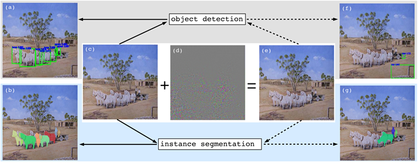
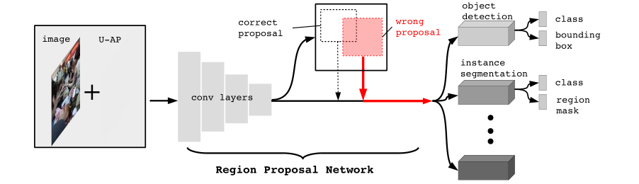
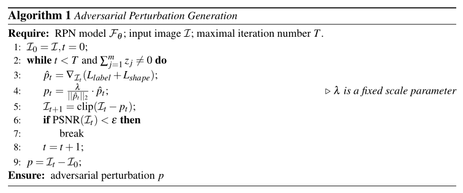
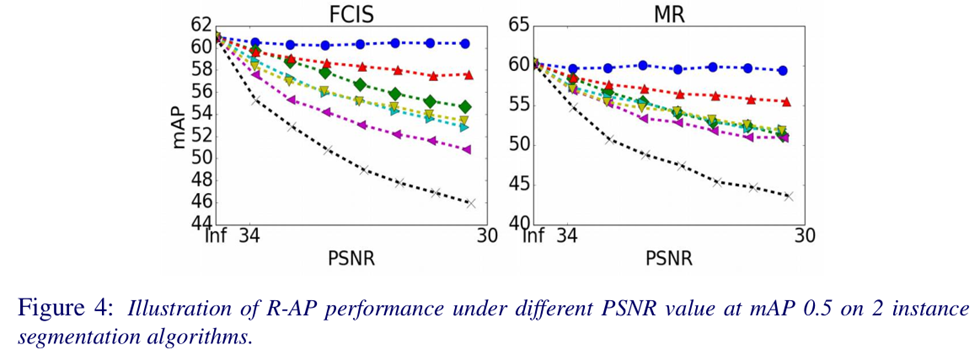
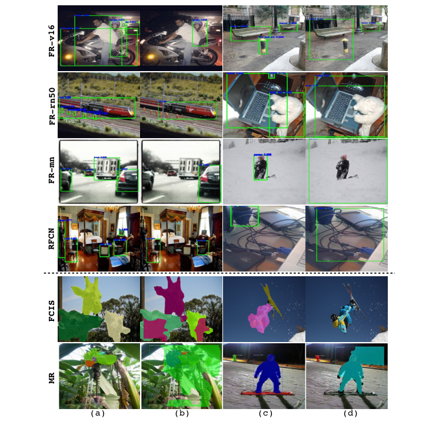

# Robust Adversarial Perturbation

> Robust Adversarial Perturbation on Deep Proposal-based Models.

- [Main contributions](#main-contributions)
- [R-AP features](#r-ap-features)
- [Methods](#methods)
  - [Loss function](#loss-function)
  - [Label loss](#label-loss)
  - [Shape loss](#shape-loss)
  - [Algorithm](#algorithm)
- [Experiments](#experiments)
  - [Object detection](#object-detection)
  - [Image / Instance segmentation](#image--instance-segmentation)
  - [Sample images](#sample-images)
- [Conclusions](#conclusions)
- [Referred in](#referred-in)

:::tip 🌏 Source
🔬 Downloadable at: <https://arxiv.org/abs/1809.05962>. CVPR 2020.
:::

R-AP stands for robust adversarial perturbations. **R-AP focuses on attacking RPNs, namely: Region Proposal Networks,** to universally degrade the performance of object detection and instance segmentation algorithms.

The research on R-AP is the first work to thoroughly investigate the effects of adversarial perturbation on RPNs.

## Main contributions

**Attack targets:**

- Deep proposal-based object detectors
- Instance segmentation algorithms

**Focuses on:** RPN, Region Proposal Networks.

**Algorithm:** designed a loss function that combines (i) label loss and (ii) shape loss, each of which targets a specific aspect of RPN. In contrast to previous attack paradigms that only disturb object class label predictions, our method not only disturbs the proposal label prediction in RPN, but also distracts the shape regression, which can explicitly degrade the bounding box prediction in proposal generation.

## R-AP features

R-AP method focuses on attacking deep proposal-based models that are fundamental to majority of object detectors and instance segmentation algorithms. A majority of object detectors and instance segmentation algorithms use a **Region Proposal Network (RPN) to extract object-like regions, known as proposals,** from an image and then process the proposals further to obtain:

1. object class labels and bounding boxes in object detection, and ...
2. ... the instance class labels and region masks in instance segmentation.

If a RPN is successfully attacked by an adversarial perturbation, such that no correct proposals are generated, the subsequent process in the object detector and instance segmentation pipeline will be affected by design.

## Methods

All mainstream deep proposal-based object detectors and instance segmentation algorithms rely on a few standard RPNs to provide proposals for subsequent processes. Once the RPN is disturbed, the performance of these deep models is naturally degraded. **As such, our R-AP method is suitable in nature for black-box attack to these models,** i.e., without the need to know their implementation details.

### Loss function

R-AP's goal is to seek an minimal adversarial perturbation added to image $\mathcal{I}$ to fail a RPN. The loss function in R-AP is designed as the summation of:

- The label loss $L_{\textrm{label}}$, which is a general paradigm used in previous methods to disturb the label prediction, and ...
- The shape loss $L_{\textrm{shape}}$, which is the newly proposed term to explicity disturb bounding box shape regression.

$​\textrm{PSNR}$ (Peak Signal to Noise Ratio) is employed to evaluate the distortion of adversarial perturbation, because it is an approximation of human perception of image quality. (The higher the better - [[image-quality-assessment]])

Finally, the R-AP algorithm generates a perturbed image $\mathcal{I}$ by optimizing the following loss as:

$$\min_{\mathcal{I}} L_{\textrm{label}}(\mathcal{I};\mathcal{F}_\theta)+L_{\textrm{shape}}(\mathcal{I};\mathcal{F}_\theta),\ \textrm{s.t.}\ \textrm{PSNR}(\mathcal{I})\geq\varepsilon$$

### Label loss

The label loss $L_{\textrm{label}}$ is given by:

$$L_{\textrm{label}}(\mathcal{I};\mathcal{F}_\theta)=\sum_{j=1}^mz_j\log(s_j)$$

In other words, minimizing this loss is equivalent to decreasing confidence score of positive proposals.

### Shape loss

The goal of shape loss is to explicitly disturb the shape regression. $L_{\textrm{shape}}$ is defined as:

$$L_{\textrm{shape}}(\mathcal{I};\mathcal{F}_\theta)=\sum_{j=1}^m((\Delta x_j-\tau_x)^2+(\Delta y_j-\tau_y)^2+(\Delta w_j-\tau_w)^2+(\Delta h_j-\tau_h)^2)$$

where $\tau_x,\tau_y,\tau_w,\tau_h$ are large offsets defined to substitute the real offset between anchor boxes and mached ground truth bounding boxes. By minimizing this equation, the R-AP method forces predicted offset $\Delta x_j,\Delta y_j,\Delta w_j,\Delta h_j$ approaching $\tau_x,\tau_y,\tau_w,\tau_h$ respectively, such that the shape of the bounding box will be incorrect.

### Algorithm

The R-AP generation algorithm:

## Experiments

The R-AP method is evaluated on the MS COCO 2014 dataset.

### Object detection

### Image / Instance segmentation

### Sample images

Visual results of the R-AP attack on several mainstream object detectors (first 4 rows) and instance segmentation algorithms (last 2 rows):

## Conclusions

The R-AP method designed a new loss function to not only disturb label prediction but also degrade shape regression. The design of shape loss and the use of PSNR is worth noticing.

:::backlinks
## Referred in
* [[papers]]
	* | Paper Title                         | Publication |
| [[invisible-adv]]                   | IEEE 2019   |
| [[robust-adversarial-perturbation]] | CVPR 2020   |
| [[perceptual-color-distance]]       | CVPR 2020   |
| [[adversarial-camouflage]]          | CVPR 2020   |
:::

[//begin]: # 'Autogenerated link references for markdown compatibility'
[image-quality-assessment]: image-quality-assessment.md 'Image Quality Assessment'
[papers]: papers.md 'Papers'
[invisible-adv]: invisible-adv.md 'Invisible Adversarial Attack'
[robust-adversarial-perturbation]: robust-adversarial-perturbation.md 'Robust Adversarial Perturbation'
[perceptual-color-distance]: perceptual-color-distance.md 'Perceptual Color Distance'
[adversarial-camouflage]: adversarial-camouflage.md 'Adversarial Camouflage'
[//end]: # 'Autogenerated link references'
